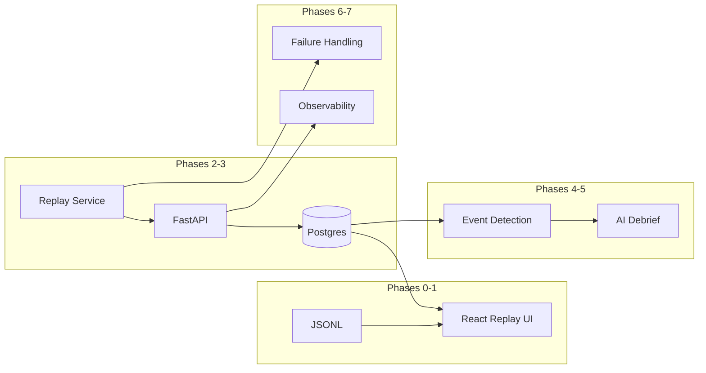

# Flight Telemetry Debrief Platform — Phased Roadmap

A phased roadmap for the Flight Telemetry Debrief Platform demo for Navi, starting from the existing Mobile→Pensacola JSONL. Each phase ships a demo-ready slice and deliberately grows Python skills (typing, async, data pipelines, testing, observability).

## Current state

Greenfield repo with one asset: [`mobile_to_pensacola_synthetic_telemetry.jsonl`](mobile_to_pensacola_synthetic_telemetry.jsonl) (2,641 samples, ~44 min, Cessna 172S, KMOB→KPNS). Schema is **nested** (`position`, `attitude`, `performance`, `configuration`) and already includes a `phase` label. Treat those labels as **ground truth for tests**, not as something the detector should read in production.

**Default emphasis:** balanced demo + intentional Python practice each phase.



## Phase checklist

- [ ] **Phase 0:** Python package, Pydantic schema, CLI validate/stats, pytest, monorepo skeleton
- [ ] **Phase 1:** React map/charts/playback + thin FastAPI telemetry endpoint (wow demo)
- [ ] **Phase 2:** Postgres + SQLAlchemy + Alembic + import job + flight/telemetry APIs
- [ ] **Phase 3:** Async replay service POSTing `/telemetry` at 1×/10×/100×
- [ ] **Phase 4:** Pure Python event detectors + events API + timeline UI
- [ ] **Phase 5:** LLM debrief with structured outputs + Generate Debrief UI
- [ ] **Phase 6:** Structured logging, metrics, tracing, simple dashboards
- [ ] **Phase 7:** Chaos fixtures + resilient ingest (dedupe, reorder, gaps, retries)
- [ ] **Phase 8 (optional):** MSFS SimConnect collector → same `/telemetry` API

---

## Phase 0 — Python foundation (2–3 days)

**Goal:** Stand up a real Python project before any UI, so every later phase builds on good habits.

**Ship:**
- `pyproject.toml` (uv or poetry), `src/flight_replay/` package layout
- Pydantic models matching the nested JSONL schema
- CLI: `flight-replay validate`, `stats`, `normalize` (flatten to the fields the UI needs)
- Pytest covering parse + schema validation
- Monorepo skeleton: `backend/`, `frontend/`, `data/`, `docker-compose.yml` (Postgres stub only)

**Python you learn:** packaging, type hints, Pydantic v2, pytest, CLI with Typer/Click, reading JSONL streaming (don’t load 2.6k lines into memory patterns you’ll reuse at scale).

**Interview talking point:** “I modeled telemetry as a versioned schema first, so ingest and UI share one contract.”

---

## Phase 1 — Wow demo UI (4–6 days)

**Goal:** Instructor-grade replay that could be screen-recorded alone.

**Ship (React + TS):**
- Map (Mapbox GL JS + Deck.gl aircraft layer) over Mobile–Pensacola corridor
- Synced altitude + airspeed charts (Recharts)
- Timeline slider, play/pause, 1× / 5× / 10× / 50×
- Phase markers on timeline (initially from JSONL `phase` — temporary; Phase 4 replaces with detected events)
- Load via thin FastAPI static/file endpoint **or** Vite-imported JSON — prefer FastAPI so Python stays in the loop: `GET /flights/{id}/telemetry`

**Python you learn:** FastAPI basics, dependency injection, CORS, serving typed responses from Pydantic models.

**Demo checkpoint:** 60-second clip of aircraft moving with charts + controls. This is your fallback if later phases slip.

---

## Phase 2 — Real backend + persistence (4–5 days)

**Goal:** Replace “file into browser” with a real service boundary.

**Architecture:**

```text
JSONL import job → FastAPI → Postgres → React (TanStack Query)
```

**Ship:**
- SQLAlchemy 2.0 models: `flights`, `telemetry_points`, `events` (events empty until Phase 4)
- Alembic migrations
- Endpoints: list flights, get flight, get telemetry (paginated / time-range), get events
- One-shot import script: `flight-replay import data/...jsonl`
- Docker Compose: `api` + `db` + (later) `replay`

**Python you learn:** SQLAlchemy 2.0 async or sync consistently, Alembic, repository vs service layer, bulk insert performance, integration tests with a test DB.

**Interview talking point:** “UI never owns storage; the API is the contract for replay, live MSFS, or anything else.”

---

## Phase 3 — Streaming ingestion (3–4 days)

**Goal:** Time-accurate ingest so live sources plug in without UI changes.

**Ship:**
- Replay service (Python): read JSONL, `POST /telemetry` (or WebSocket) at wall-clock rate × speed
- Speeds: 1×, 10×, 100×
- API: upsert flight, append points, reject/record bad payloads
- UI: live mode that polls or subscribes while replay runs

**Python you learn:** `asyncio`, `httpx` AsyncClient, backpressure, graceful shutdown, rate control with timestamps (not `sleep(1)`), structured error handling.

**Interview talking point:** “Same `/telemetry` path whether the producer is a file replayer or SimConnect.”

---

## Phase 4 — Flight analysis / event detection (4–5 days)

**Goal:** Auto-build an instructor timeline from telemetry only.

**Detect (v1):**
- takeoff, climb, cruise, descent, landing
- hard landing, excessive bank, excessive descent rate

**Defer:** stalls, unstable approach (stretch).

**Ship:**
- Pure functions in `backend/analysis/` — input: sequence of points; output: event list with timestamps
- Persist to `events`; expose `GET /flights/{id}/events`
- UI timeline populated from detected events (stop trusting JSONL `phase` in the UI)
- Unit tests comparing detections to labeled phases (tolerance windows)

**Python you learn:** algorithmic thinking on time series, dataclasses/NamedTuples, hypothesis/property tests optional, clean separation of analysis from I/O (easy to unit test without FastAPI).

**Interview talking point:** “Detectors are pure Python, tested against synthetic ground truth, then wired into the pipeline.”

---

## Phase 5 — AI debrief (2–3 days)

**Goal:** Meaningful LLM integration without training a model.

**Ship:**
- `POST /flights/{id}/debrief` → OpenAI Responses API (or compatible) with **structured outputs**
- Prompt inputs: flight summary, events, telemetry stats (max alt, max bank, landing VS, etc.)
- Persist debrief; UI “Generate Debrief” panel
- Env-based API key; graceful failure if missing

**Python you learn:** LLM client usage, Pydantic structured outputs, prompt/versioning, caching debriefs, never sending raw full JSONL to the model (summarize in Python first).

**Demo checkpoint:** Full Navi video arc — play → events → Generate Debrief → architecture walkthrough.

---

## Phase 6 — Observability (2–3 days)

**Goal:** Show you don’t skip the ops layer.

**Ship:**
- Structured logging (`structlog`)
- Metrics: ingest rate, processing latency, failures, active flights, queue depth (Prometheus + Grafana in Compose, or OpenTelemetry → simple dashboard)
- Request tracing (correlation IDs through FastAPI middleware)
- Replay stats endpoint: points sent, lag, speed

**Python you learn:** middleware, contextvars for request IDs, metric instrumentation, what “good” logs look like in production services.

---

## Phase 7 — Failure handling (2–3 days)

**Goal:** Resilient ingest — strong interview material.

**Ship:**
- Chaos fixtures: duplicate, missing, delayed, out-of-order packets
- Pipeline behavior: idempotent upserts (dedupe key), reorder buffer or sequence numbers, gap detection events, retries with backoff on producer side
- Tests that assert correct final flight state under each failure mode

**Python you learn:** idempotency, defensive parsing, retry libraries / custom backoff, writing failure-mode tests first.

---

## Phase 8 — MSFS (optional, only if Phases 1–5 are demo-ready)

Tiny Windows collector: SimConnect → HTTP `POST /telemetry`. No API/UI changes if Phase 3 is solid. Skip for the interview video unless you already have a Windows box and spare time.

---

## Suggested calendar (interview-oriented)

| Window | Focus | Demo-ready artifact |
|--------|--------|---------------------|
| Week 1 | Phases 0–1 | Map replay video |
| Week 2 | Phases 2–3 | Architecture diagram + live ingest |
| Week 3 | Phases 4–5 | Full debrief demo video |
| Week 4 | Phases 6–7 | Observability + resilience talking points |

If time is short: **stop after Phase 5**. Phases 6–7 deepen interview answers; Phase 8 is optional.

---

## Repo layout to grow into

```text
flight-replay/
  data/                    # move JSONL here
  backend/
    src/flight_replay/
      api/                 # FastAPI routes
      models/              # Pydantic + SQLAlchemy
      analysis/            # event detectors
      replay/              # streaming client
      debrief/             # LLM
    tests/
    alembic/
  frontend/                # Vite React TS
  docker-compose.yml
  .github/workflows/ci.yml
```

---

## Stack commitments

- **Frontend:** React, TypeScript, Vite, TanStack Query, Mapbox GL JS, Deck.gl, Recharts
- **Backend:** Python 3.12+, FastAPI, SQLAlchemy 2, Alembic, Postgres, Pydantic v2, uv
- **AI:** OpenAI Responses API + structured outputs
- **Infra:** Docker Compose locally; GitHub Actions for lint + pytest + frontend build; AWS later if needed

---

## Python learning spine (what “effective” means here)

1. **Types + models** (Phase 0) → schema is the source of truth
2. **HTTP services** (1–2) → FastAPI + DB
3. **Async I/O** (3) → replay at scale
4. **Domain logic** (4) → testable analysis without framework coupling
5. **External APIs** (5) → LLM with structured I/O
6. **Production habits** (6–7) → logs, metrics, failure modes

After Phase 5 you can honestly say you own a telemetry system end-to-end in Python, not just a map demo.

---

## Stretch (only after the demo video exists)

Synchronized audio, STT timeline, weather/terrain overlays, scrub any segment, dual-flight compare, instructor notes, collaborative debrief — pick at most one if it strengthens the Navi story.
